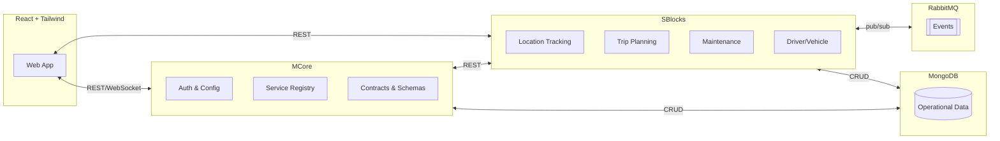

# Firewall Five — SAMFMS  
Modular Fleet Management System for growing fleets 🚚✨

---

## 📚 Documentation

| Resource | Link |
|---|---|
| SRS & Architecture | [Requirements](docs/Demo3/Software%20Requirement%20Specification.pdf) |
| Project Board | [GitHub Projects](https://github.com/orgs/COS301-SE-2025/projects/208/views/2) |
| Coding Standards | [Guide](docs/Demo3/Coding_Standards.pdf) |
| Technical Installation | [Install Guide](docs/Demo3/Technical_Installation_Guide.pdf) |
| User Manual | [Manual](docs/Demo3/SAMFMS%20User%20Manual.pdf) |
| Deployment Strategy | [Deployment Model](docs/Demo3/Deployment%20Strategy.pdf) |
| Service Contracts | [Contracts](docs/Demo3/Service%20Contracts-1.pdf) |
| Branching Strategy | [Strategy](docs/Demo3/Branching_Strategy.pdf) |
| Updated Domain Model | [Domain Model](docs/Demo3/images/DomainModel.png) |

Older docs:
- Demo 1 SRS: [Google Doc](https://docs.google.com/document/d/1En1Mck7JwaSdKjgyvRhmX5pXqHhVSUlhZhp7XU-f_K4/edit?tab=t.0)
- Demo 2 SRS: [Google Doc](https://docs.google.com/document/d/1G0PdNyn39kSutfvn8tCN5x-yCHrte0QFu_v2-gYdXPU/edit?tab=t.0)
- Demo 2 Slides: [Canva Presentation](https://www.canva.com/design/DAGrW5d1HYA/LC1cf0PKTY7MIsAVtObYPA/edit)

---

## 👥 Team

| Profile | Name (Student No.) | GitHub | LinkedIn | Focus |
|---|---|---|---|---|
|  | Mr. Stefan Jansen van Rensburg (u22550055) | [StefanJvRCodes](https://github.com/StefanJvRCodes) | [Stefan Jansen van Rensburg](https://linkedin.com/in/stefan-JvR) | Team lead, CI/CD, daemon and backend services (storage, CRUD, file I/O, server and user management) |
|  | Mr. Johan Jansen van Rensburg (u22590732) | [22590732](https://github.com/22590732) | [Johan Jansen van Rensburg](https://www.linkedin.com/in/nicolaas-jansen-van-rensburg-202629363/) | UI engineering and design, frontend architecture, service integration |
|  | Mr. Laird Glanville (u22541332) | [Laird-G](https://github.com/Laird-G) | [Laird Glanville](https://www.linkedin.com/in/laird-glanville-046270326/) | Backend engineering, MCore development, modular SBlocks |
|  | Mr. Morné van Heerden (u21482153) | [Mornevanheerden](https://github.com/Mornevanheerden) | [Morné van Heerden](https://www.linkedin.com/in/morne-van-heerden-a0b173355/) | DevOps and systems, repository maintenance, services engineering |
|  | Mr. Herman Engelbrecht (u22512374) | [herrie732](https://github.com/herrie732) | [Herman Engelbrecht](https://www.linkedin.com/in/herman-johan-engelbrecht-a6b6a8327/) | Services engineering, loosely coupled SBlocks, frontend and database management |

---

## 🧭 Overview

SAMFMS is a modular fleet platform built to avoid “buy-everything” bloat. Start with a lightweight core (MCore), then add only the modules you need (SBlocks): location tracking, trip planning, maintenance, and driver/vehicle management. Simple to start. Easy to extend. Cost-aware for smaller teams.

### Why SAMFMS?  
- ✅ Install only what you need  
- ✅ Clean separation between core, services, and UI  
- ✅ Event-driven and scalable from day one  
- ✅ Friendly developer experience (monorepo, shared contracts, strong docs)

---

## 🧱 Architecture

### MCore
- Authentication hooks, configuration, service discovery, and shared contracts.
- Central API routing and standards enforcement.
- Event catalog and schema definitions for cross-module messaging.

### SBlocks (Modules)
- Independently deployable feature services that register with MCore.
- Stable FastAPI interfaces and clear boundaries.
- Examples: location, trips, maintenance, driver/vehicle.

### Communication & Data
- FastAPI for APIs and service-to-service calls.  
- RabbitMQ for async, decoupled events between modules.  
- MongoDB for operational data and histories.

### Frontend
- React + Tailwind for a crisp, responsive UI.  
- Leaflet for live maps, positions, and routes.

### Deployment
- Dockerized services with Compose for local orchestration.  
- Environment-driven configuration and secrets.  
- Production can deploy modules independently.

---

## Notes:
- Issues are tracked in [GitHub Issues](https://github.com/COS301-SE-2025/SAMFMS/issues).
- Use the [Branching Strategy](docs/Demo3/Branching_Strategy.pdf) for PR flow and releases.

---

## 🧰 Technology

